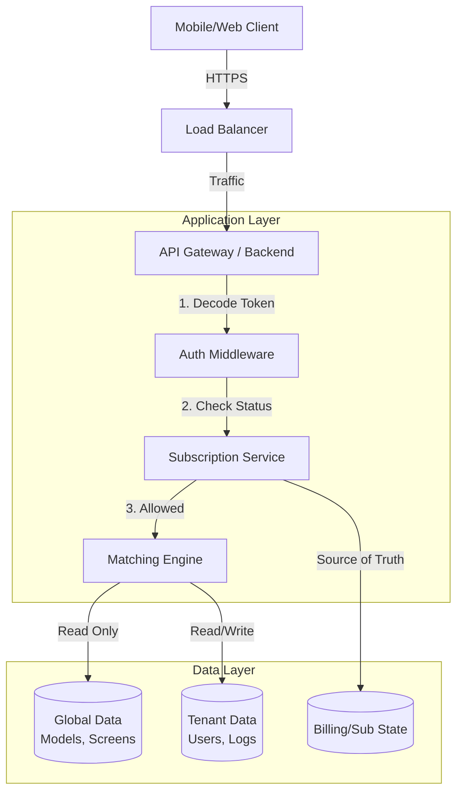

# SaaS Architecture Design (Multi-Tenant)

## 1. Tenant Isolation Strategy
**Decision: Row-Level Isolation (Shared Database, Shared Schema)**

**Reasoning:**
- **Global Data Dominance**: The core value is the *Shared Global Data* (Phone Models, Screens, Glass SKUs). Every tenant queries this same dataset. using separate schemas would make joining "Tenant History" with "Global Models" painful and slow.
- **Scale**: 10,000 tenants is manageable with indexed `tenant_id` columns.
- **Simplicity**: Easier migration and maintenance than 10,000 separate schemas.

**Implementation:**
- All tenant-owned tables (`users`, `subscriptions`, `search_history`) MUST have a `tenant_id` column.
- All queries to these tables MUST include `WHERE tenant_id = ?`.
- Global tables (`brands`, `screens`) DO NOT have `tenant_id`.

## 2. Ownership Boundaries

| Data Category | Owner | Access | Examples |
| :--- | :--- | :--- | :--- |
| **Global Data** | Platform | **Read-Only** for Tenants | Brands, Models, Screen Profiles, Glass SKUs, Universal Maps. |
| **Tenant Data** | Shop | **Read/Write** (Scoped) | Shop Users (Staff), Billing Info, API Keys. |
| **Operational Data** | Shop | **Read/Write** (Scoped) | Search History, Favorites, Reported Mismatches (Submitted by tenant, Owned by Platform). |

## 3. High-Level Architecture Diagram



## 4. Authentication & Authorization
- **Strategy**: JWT (JSON Web Tokens).
- **Token Payload**:
  ```json
  {
    "uid": "user_123",
    "tenant_id": "shop_456",
    "role": "OWNER"
    // NO PLAN DATA HERE. JWT is NOT source of truth for billing.
  }
  ```
- **Roles**:
  - **Platform Admin** (Split Concept):
    - `DATA_EDITOR`: Propose changes to Global Data.
    - `DATA_APPROVER`: Review & Publish changes (Rollback capability).
  - `OWNER`: Can manage Staff, Billing, and see Analytics for `tenant_id`.
  - `STAFF`: Can only perform Search. Restricted from Settings.

## 5. Subscription Enforcement
**Location**: Service Layer / Middleware.

**Logic:**
1.  **Request**: `GET /api/match?model=RedmiNote10` from User.
2.  **Auth Check (JWT)**: Validates user identity and `tenant_id`.
3.  **Subscription Check (Server-Side)**:
    - Middleware calls `SubscriptionService` (backed by Redis/DB).
    - **CRITICAL**: Does NOT trust the JWT for plan status.
    - If status is `EXPIRED` or `PAYMENT_FAILED` -> Return 402.
4.  **Service Logic (Feature Gating)**:
    - Logic generates 1 Exact Match + 3 Universal Matches.
    - Service calls `SubscriptionService` to get current Plan Features.
    - If BASIC: Filter Universal Matches (Limit to 5/day or mask them).
    - If PRO: Return all results.

## 6. Risks & Tradeoffs
- **Risk (Data Leakage)**: If a developer forgets `WHERE tenant_id = ?`, Tenant A sees Tenant B's data.
  - *Mitigation*: Use an ORM or DAO layer that strictly enforces this context.
- **Risk (Global Updates)**: A wrong update to a Global Screen Profile affects 10,000 shops instantly.
  - *Mitigation*: `DATA_EDITOR` vs `DATA_APPROVER` workflow + Staging Environment.
